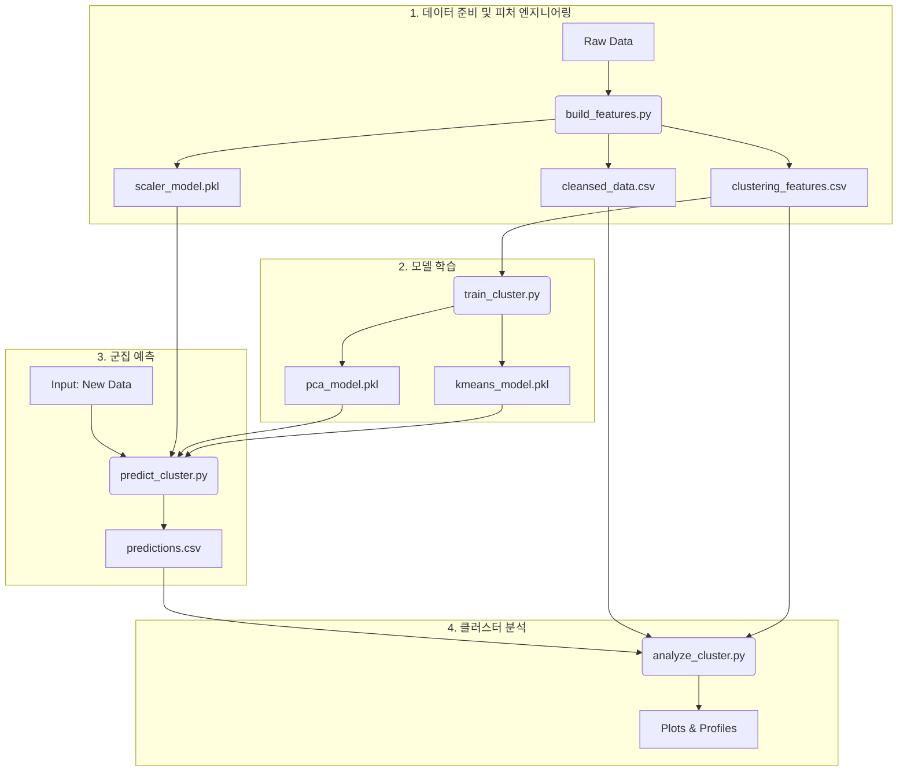

# ML Clustering Pipeline 실행 가이드 (v2)

본 문서는 `ml/clustering/src/` 디렉토리 내의 Python 스크립트를 사용하여 전체 클러스터링 파이프라인을 실행하는 방법을 안내합니다. 모든 스크립트는 프로젝트 루트 디렉토리에서 `python -m ml.clustering.src.스크립트명` 형태로 실행하도록 구성되어 있습니다.

## 전체 흐름도

아래는 데이터 전처리부터 모델 학습, 예측, 분석에 이르는 전체 파이프라인의 흐름을 나타낸 다이어그램입니다.



---

## 실행 순서 및 방법

각 스크립트는 독립적으로 실행 가능하며, 아래 순서대로 실행하면 전체 파이프라인이 동작합니다.

### 1단계: 데이터 준비 및 피처 엔지니어링

이 단계는 원시 데이터(`Raw Data`)를 가져와 정제, 파생변수 생성, 피처 엔지니어링을 모두 수행하고 후속 단계에 필요한 모든 데이터와 스케일러 모델을 생성합니다. **파이프라인의 시작점입니다.**

- **실행 명령어**:
  ```bash
  python -m ml.clustering.src.build_features
  ```
- **프로세스**:
  1.  `config.yaml`에 정의된 원시 데이터를 로드합니다.
  2.  데이터 정제(`cleansing`)를 수행합니다.
  3.  **(신규)** 정제된 데이터(`cleansed_data.csv`)를 `data/processed/`에 저장합니다. (4단계 분석에서 사용)
  4.  파생변수(`LISTED_STATUS`, `FNDF_DT_SINCE`)를 생성합니다.
  5.  다중공선성 제거, 인코딩, 스케일링 등 피처 엔지니어링을 수행합니다.
- **주요 출력물**:
  - `data/processed/cleansed_data.csv`: 정제 및 파생변수 생성이 완료된 데이터.
  - `data/processed/clustering_features.csv`: 모델 학습에 직접 사용될 최종 피처 데이터.
  - `ml/clustering/models/scaler_model.pkl`: 수치형 변수 스케일링에 사용된 `PowerTransformer` 모델.

### 2단계: 클러스터링 모델 학습

피처 엔지니어링이 완료된 데이터를 사용하여 클러스터링 모델을 학습시키고, 예측에 필요한 모델들을 저장합니다.

- **실행 명령어**:
  ```bash
  python -m ml.clustering.src.train_cluster
  ```
- **프로세스**:
  1.  `clustering_features.csv` 파일을 로드합니다.
  2.  PCA를 사용해 차원을 축소합니다.
  3.  K-Means 모델을 학습합니다.
  4.  학습된 모델의 성능을 평가합니다.
- **주요 출력물**:
  - `ml/clustering/models/pca_model.pkl`: 차원 축소에 사용된 `PCA` 모델.
  - `ml/clustering/models/kmeans_model.pkl`: 학습된 `KMeans` 클러스터링 모델.

### 3단계: 새로운 데이터에 대한 군집 예측

학습된 모델(스케일러, PCA, K-Means)을 사용하여 이전에 보지 못한 새로운 데이터의 군집을 예측합니다.

- **실행 명령어**:
  ```bash
  python -m ml.clustering.src.predict_cluster
  ```
- **프로세스**:
  - `if __name__ == '__main__'` 블록은 테스트를 위해 **더미 데이터(`dummy_new_data.csv`)를 자동으로 생성**하여 예측을 수행합니다.
  - 실제 예측 시에는 `prediction_pipeline` 함수를 직접 호출하여 사용합니다.
- **주요 출력물**:
  - `predictions.csv`: 더미 데이터에 예측된 `cluster` 라벨이 추가된 파일.

### 4단계: 클러스터 분석

예측된 군집 결과를 시각화하고, 각 군집이 어떤 특성을 가지는지 프로파일링하여 비즈니스 인사이트를 도출합니다.

- **실행 명령어**:
  ```bash
  python -m ml.clustering.src.analyze_cluster
  ```
- **프로세스**:
  1.  `predictions.csv`, `cleansed_data.csv`, `clustering_features.csv` 파일을 로드합니다.
  2.  데이터를 병합하여 분석용 데이터셋을 구성합니다.
  3.  UMAP, PCA(선택 사항)를 통해 클러스터를 시각화합니다.
  4.  정제된 원본 데이터(`cleansed_data.csv`)를 사용하여 각 클러스터의 특성을 프로파일링합니다.
- **주요 출력물**:
  - UMAP 시각화 플롯 (팝업)
  - 각 군집의 특성을 요약한 프로파일링 결과 (콘솔 출력)
